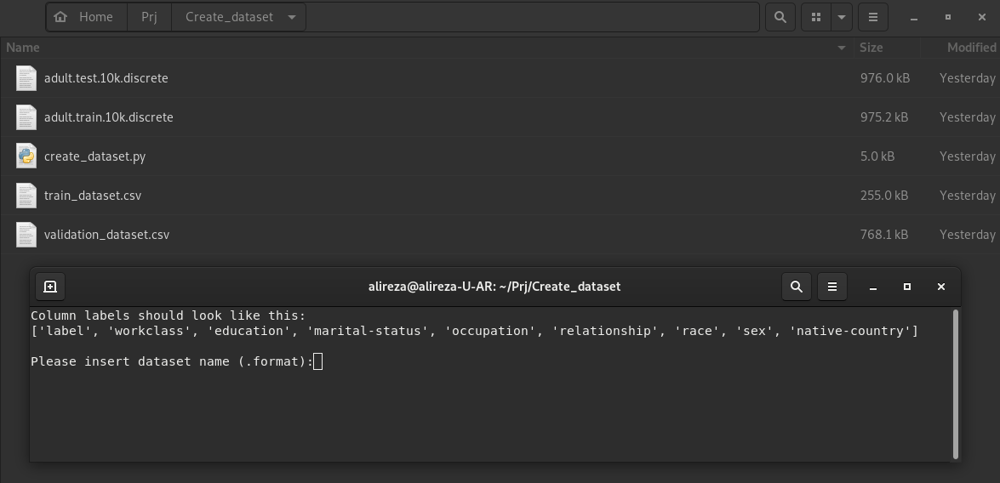
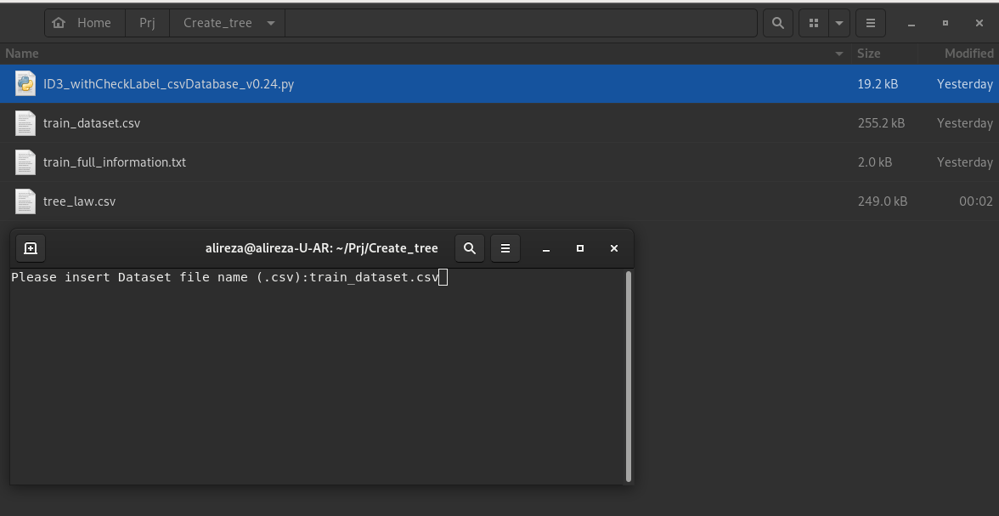
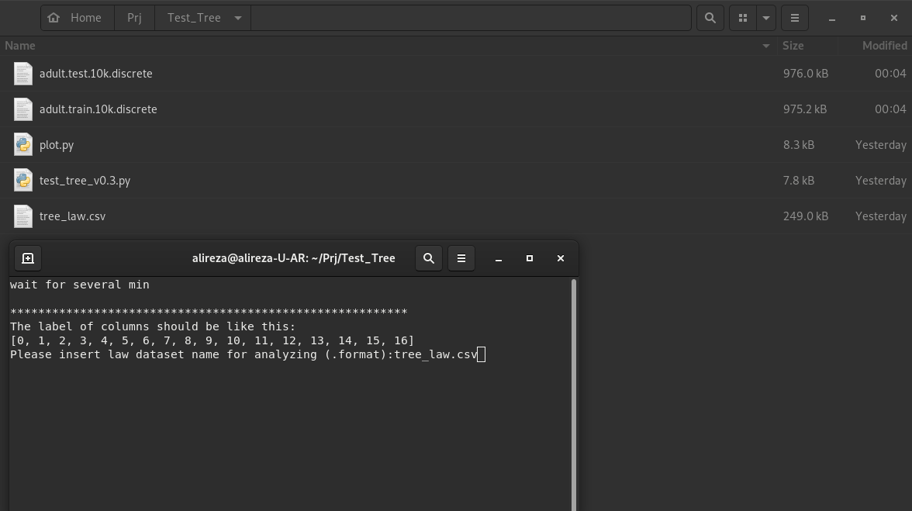

<h1> Decision Tree with ID3 algorithm </h1>
<h2>Folders</h2> 
<h3>Create_dataset:</h3>
<ul>
<li> In this folder us can make a .csv file of .discrete files 
<li> There is a Adult dataset in this folder and you can use of this dataset 
<li> for create .csv files of .discrete files you should run create_dataset.py 
<li> after run create_dataset.py, program get .discrete file name 
<li>	 Attention: The .discrete file must have the following labels: 
<li>	 Labels: dataset_headernames = ['label', 'workclass', 'education', 'marital-status', 'occupation', 'relationship', 'race', 'sex', 'native-country']  
<li> After run, create two train_dataset.csv and validation_dataset.csv 
</ul>

 
 
<h3>Create_tree:</h3>
<ul>
<li> In this folder you can make a tree with ID3 algorithm 
<li> You should run ID3_withCheackLabel_csvDataset_v0.24.py 
<li> After run, you have to give a train dataset (.csv), for example you can use Create_dataset/train_dataset.csv or train_dataset.csv. 
<li> After train, The model make a tree_law.csv that show the tree law also make a train_full_information.txt that show a info dictionary of the dataset. 
</ul>

 
 
<h3>Test_Tree:</h3>
<ul>
<li> you can use of this folder for test the Tree. 
</ul>

 
 
 
 
Thank you in advance for improving this app 
AR
